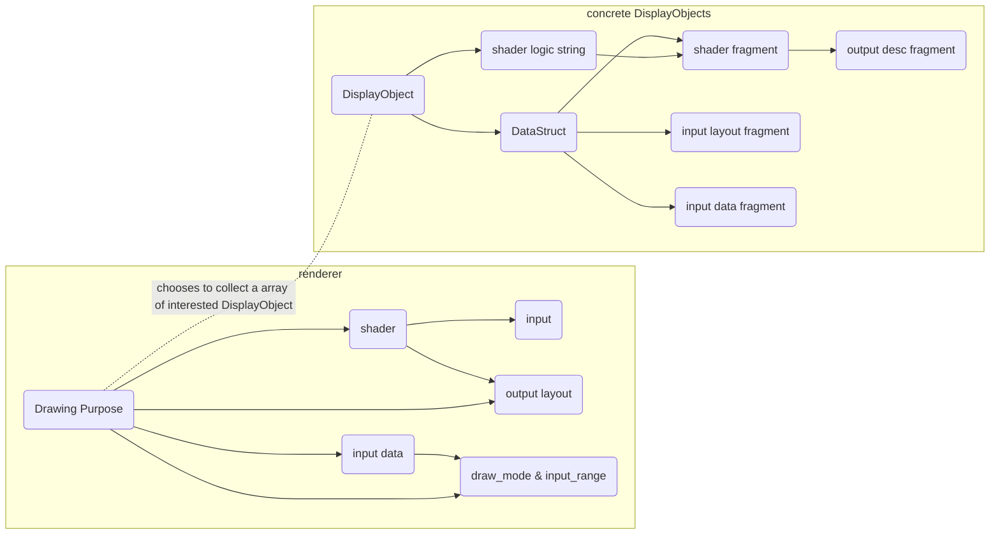

# The right abstraction

I'm thinking about a better structure for the whole rendering, and the key is to figure out what is the cause and what is the effect.

For a rendering task, it needs to decide the following things:

```ts
rendering(
    /// #1 what's the output of the draw, the format, loadOps, storeOps, multisampled, etc
    pass,

    /// #2 what's the input layout, such as attribute buffer layout, if there is a index buffer, what's the uniform layout, etc
    /// what's the shader, i.e. the drawing logic
    pipeline,

    /// #3 supply the input data, such as the uniform data(via setBindGroup), the attribute buffer(via setIndexBuffer/setVertexBuffer). All the data is GPU data 
    /// #4 specify the drawing method, such as drawIndex/drawInstanced, etc.
    drawing_command
)
```

The #1 and #2 are like defining the input type of a function, and #3 and #4 are like calling the function with arguments.

So we can come up with two things:

1. declare: something like:

    ```ts
    function declare_draw(input_layout, shader, output_desc): (input: input_layout, output: output_desc) => void;
    ```

2. call:

    ```ts
    let input: input_layout = from_CPU(cpu_data); // upload 
    let output: output_desc = create_output(output_desc, store_load_ops, multisampled); // here both shader logic and drawing purpose decide the output structure
    draw(input, output); // bind the draw flow: input -> draw -> output
    dispatch_draw(draw_mode, input_rage); // trigger the real draw, make the machine do the work. The draw_mode and input_range are decided by the input and drawing purpose

    // another way to see it is as following, you supply the drawing input arguments all at once.
    call(input, draw, output, draw_mode, input_range)
    // or
    call(() => draw(input, output), draw_mode, input_range)
    ```

Shader decides the input the output type. And input data decides the draw_mode and input_range.



So here comes a builder pattern:

```ts
// before rendering, at init time
let (shader_fragments, input_layout_fragments, output_desc_fragments) = collect(DisplayObjects)
let shader = buildFullShader(shader_fragments)
let drawing_purpose = build_drawing_purpose(
                        shader, // we can choose to get the input/output descs from shader or from the collected fragments
                        output_layout// optional, if not set, decided by shader 
                    ) 

// at rendering time
drawing_purpose(input_data, draw_mode /*optional, if not set, decided by input_data*/, input_range/*optional, if not set, decided by input_data*/)
```
