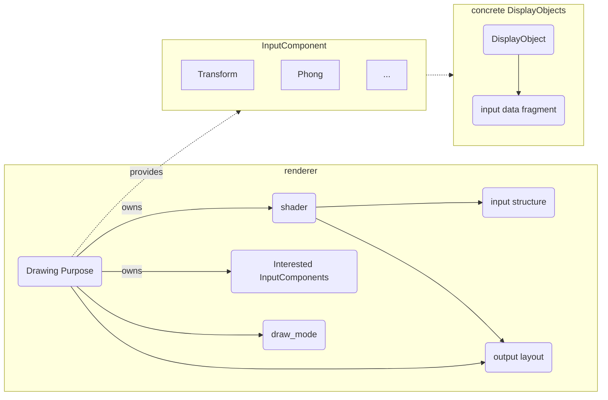
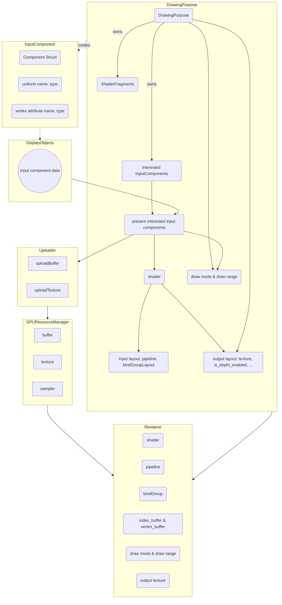

# The right abstraction

I'm thinking about a better structure for the whole rendering, and the key is to figure out what is the cause and what is the effect.

For a rendering task, it needs to decide the following things:

```ts
rendering(
    /// #1 what's the output of the draw, the format, loadOps, storeOps, multisampled, etc
    pass,

    /// #2 what's the input layout, such as attribute buffer layout, if there is a index buffer, what's the uniform layout, etc
    /// what's the shader, i.e. the drawing logic
    pipeline,

    /// #3 supply the input data, such as the uniform data(via setBindGroup), the attribute buffer(via setIndexBuffer/setVertexBuffer). All the data is GPU data 
    /// #4 specify the drawing method, such as drawIndex/drawInstanced, etc.
    drawing_command
)
```

The #1 and #2 are like defining the input type of a function, and #3 and #4 are like calling the function with arguments.

So we can come up with two things:

1. declare: something like:

    ```ts
    function declare_draw(input_layout, shader, output_desc): (input: input_layout, output: output_desc) => void;
    ```

2. call:

    ```ts
    let input: input_layout = from_CPU(cpu_data); // upload 
    let output: output_desc = create_output(output_desc, store_load_ops, multisampled); // here both shader logic and drawing purpose decide the output structure
    draw(input, output); // bind the draw flow: input -> draw -> output
    dispatch_draw(draw_mode, input_rage); // trigger the real draw, make the machine do the work. The draw_mode and input_range are decided by the input and drawing purpose

    // another way to see it is as following, you supply the drawing input arguments all at once.
    call(input, draw, output, draw_mode, input_range)
    // or
    call(() => draw(input, output), draw_mode, input_range)
    ```

Shader decides the input the output type. And input data decides the draw_mode and input_range.
We can define a **decoupling** concept called `InputComponent` to describe the input data components for different functionalities, such as Transform or Phong.
Drawing Purpose can provide new InputComponent into the registry, and have a list of interested InputComponents. By query the all the DisplayObjects with the interested components, it can get the interested component data.
A DrawingPurpose owns the shader it uses. The shader decides what is the input and output layouts are, together with the Drawing Purpose. And then DrawingPurpose and InputData decide what is the drawing method and drawing range.
But a shader fragment should not be **owned** by a DisplayObject: the same display object could use different shading logic under different drawing purpose, such as one in phong and the other one in shadow map generating.
So DrawingPurpose should own the shading logic(i.e. the shader fragment), and provide the corresponding data structure for DisplayObject to feed data into.

So we get: DrawingPurpose -> InputComponent -> DisplayObject.

The whole causality relationship is as below:



The whole process looks like:

```ts
// predefined InputComponents
let InputComponents = [Transform, Phong, IndexBuffer, VertexBuffer]

class MyDrawingPurpose {
    static shader = ...;
    static output_layout = ...;
    static interestedInputComponents = [Transform, IndexBuffer, VertexBuffer]
}

// at rendering time
let input_data = collect(DisplayObjects, MyDrawingPurpose.interestedInputComponents)
myDrawingPurpose.draw(input_data, draw_mode /*optional, if not set, decided by input_data*/, input_range/*optional, if not set, decided by input_data*/)
```

If we take GPU Resource Manager into account, the whole structure should be like:



The `shader` node in `DrawingPurpose` is a little bit more complicated than it seems. To get the full shader, a DrawingPurpose needs to traverse the input DisplayObjects and to see how many types are actually present, and gets the PresentInterestedInputComponents. From it, we can build the final full shader and the full input layout.

```ts
// at rendering time, not init time
interestedInputComponents = inputDisplayObjects.filter(i => InterestedInputComponents.has(i.type))
PresentInterestedInputComponents = interestedInputComponents.map(i => i.type)
(shader, inputLayout, outputLayout) = build(PresentInterestedInputComponents)
```
