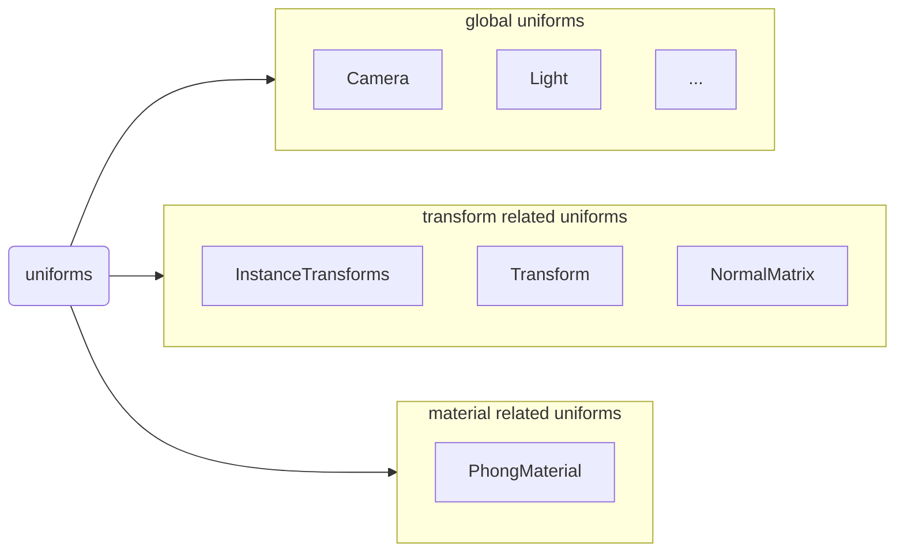

# The organizing method of Uniforms



There are 3 types of usual UBOs:

1. global uniforms
2. transform related uniforms
3. material related uniforms

We need to make each a `bindGroup`, and by merge uniforms into UBOs, we can get exact 3 UBOs:

UBO0 --- group(0) bind(0) : global uniforms

UBO1 --- group(1) bind(0): transform related uniforms

UBO2 --- group(2) bind(0): material related uniforms

## automatically merge uniforms into a UBO

We use the structure above to merge the uniforms aggressively, and use `define` to keep the uniform variable name.

Given the shader below:

```wgsl
// camera
@group(0) @binding(0) var<uniform> projectMatrix: mat4x4<f32>;
@group(0) @binding(1) var<uniform> viewMatrix: mat4x4<f32>;
@group(0) @binding(2) var<uniform> cameraPosition: vec3f;


// light
struct PointLight {
  position : vec3f,
  color : vec3f,
}

struct LightStorage {
  pointCount : u32,
  point : array<PointLight>,
}
@group(1) @binding(0) var<uniform> lights : LightStorage;


// display object
@group(2) @binding(0) var<uniform> modelMatrix: mat4x4<f32>;
@group(2) @binding(1) var<uniform> normalMatrix: mat3x4<f32>;

struct PhongMaterial {
    diffuseColor: vec3f,
    emissiveColor: vec3f,
}
@group(2) @binding(2) var<uniform> phongMaterial: PhongMaterial;

@group(2) @binding(3) var ourTexture: texture_2d<f32>;
@group(2) @binding(4) var ourSampler: sampler;
```

In pipeline creating time, we merge camera and light into 1 UBO, and split the uniforms of a display object into 2 UBO2, like below:

```wgsl
// light
struct PointLight {
  position : vec3f,
  color : vec3f,
}
struct LightStorage {
  pointCount : u32,
  point : array<PointLight>,
}

// here the name `Temp0` is automatically generated
struct Temp0 {
    // camera
    projectMatrix: mat4x4<f32>,
    viewMatrix: mat4x4<f32>,
    cameraPosition: vec3f,
    
    // light
    lights: LightStorage,
}

// the name `temp0` is automatically generated
// UBO0
@group(0) @binding(0) var<uniform> temp0 : Temp0;

// to make the variable name available in the shader code below, we generate the macro defines automatically:
#define lights temp0.lights
#define projectMatrix temp0.projectMatrix
#define viewMatrix temp0.viewMatrix
#define cameraPosition temp0.cameraPosition


// display object
@group(2) @binding(0) var<uniform> modelMatrix: mat4x4<f32>;
@group(2) @binding(1) var<uniform> normalMatrix: mat3x4<f32>;

struct PhongMaterial {
    diffuseColor: vec3f,
    emissiveColor: vec3f,
}
@group(2) @binding(2) var<uniform> phongMaterial: PhongMaterial;

struct Temp1 {
    modelMatrix: mat4x4<f32>;
    normalMatrix: mat3x4<f32>;
}
// UBO1
@group(1) @binding(0) var<uniform> temp1: Temp1;

#define modelMatrix temp1.modelMatrix
#define normalMatrix temp1.normalMatrix

struct Temp1 {
    phongMaterial: PhongMaterial,
}
// UBO2
@group(2) @binding(0) var<uniform> temp2: Temp1;

#define phongMaterial temp2.phongMaterial


// textures and samplers are untouched
@group(3) @binding(0) var ourTexture: texture_2d<f32>;
@group(3) @binding(1) var ourSampler: sampler;
```
