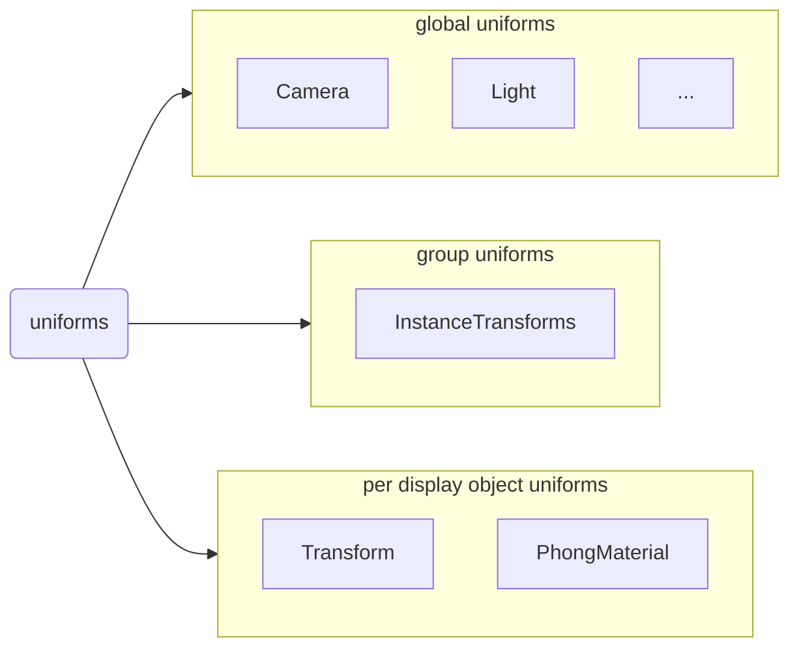

# The organizing method of Uniforms

```mermaid
graph LR;

uniforms(uniforms)

subgraph global_uniforms[global uniforms]
Camera
Light
...
end

subgraph group_uniforms[group uniforms]
InstanceTransforms
end

subgraph per_display_object_uniforms[per display object uniforms]
Transform
PhongMaterial
...
end

uniforms --> global_uniforms
uniforms --> group_uniforms
uniforms --> per_display_object_uniforms

```

There are 3 types of usual UBOs:

1. global uniforms
2. group uniforms
3. per display object uniforms
