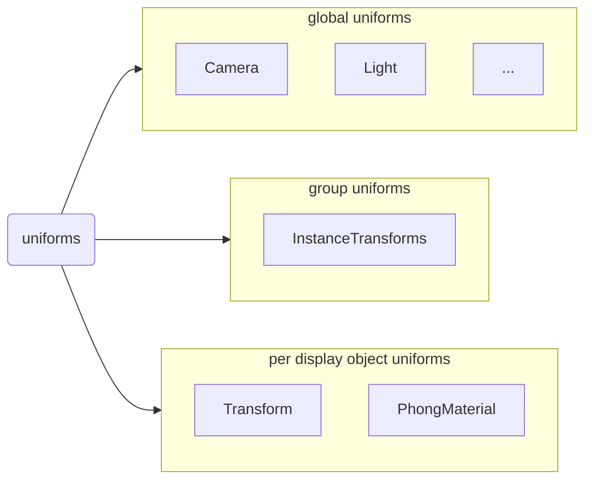

# The organizing method of Uniforms



There are 3 types of usual UBOs:

1. global uniforms
2. group uniforms
3. per display object uniforms

We need to make each a `bindGroup`:

bindGroup 0: global uniforms

bindGroup 1: group uniforms

bindGroup 2: per display object uniforms

## why not automatically merge uniforms into a UBO

The simple answer is we cannot do it.

Given the shader below:

```wgsl
// camera
@group(0) @binding(0) var<uniform> projectMatrix: mat4x4<f32>;
@group(0) @binding(1) var<uniform> viewMatrix: mat4x4<f32>;
@group(0) @binding(2) var<uniform> cameraPosition: vec3f;


// light
struct PointLight {
  position : vec3f,
  color : vec3f,
}

struct LightStorage {
  pointCount : u32,
  point : array<PointLight>,
}
@group(1) @binding(0) var<uniform> lights : LightStorage;


// display object
@group(2) @binding(0) var<uniform> modelMatrix: mat4x4<f32>;
@group(2) @binding(1) var<uniform> normalMatrix: mat3x4<f32>;

struct PhongMaterial {
    diffuseColor: vec3f,
    emissiveColor: vec3f,
}
@group(2) @binding(2) var<uniform> phongMaterial: PhongMaterial;

@group(2) @binding(3) var ourTexture: texture_2d<f32>;
@group(2) @binding(4) var ourSampler: sampler;
```

If in pipeline creating time, we merge camera uniform and light, like below:

```wgsl
// light
struct PointLight {
  position : vec3f,
  color : vec3f,
}
struct LightStorage {
  pointCount : u32,
  point : array<PointLight>,
}

struct TempStruct {
    // camera
    projectMatrix: mat4x4<f32>,
    viewMatrix: mat4x4<f32>,
    cameraPosition: vec3f,
    
    // light
    lights: LightStorage,
}

@group(0) @binding(0) var<uniform> temp : TempStruct;
```

Then all the code below it will have to get the data from `temp.projectMatrix`, `temp.lights.pointCount`, etc
and there is **no way** that we can pass the variable name `temp` to the shader segment when the shader segment is written, as the name is decided when the pipeline is created, and more importantly, the shader segments should never know how the uniforms are optimized, as the optimization strategy may change in the future.

To keep the whole thing simple, we decide not to do the optimization automatically. It's all the programmer's choice, if he wants to use a struct, the struct will be a UBO, otherwise no UBO is created.

So there is no `auto merge`.


